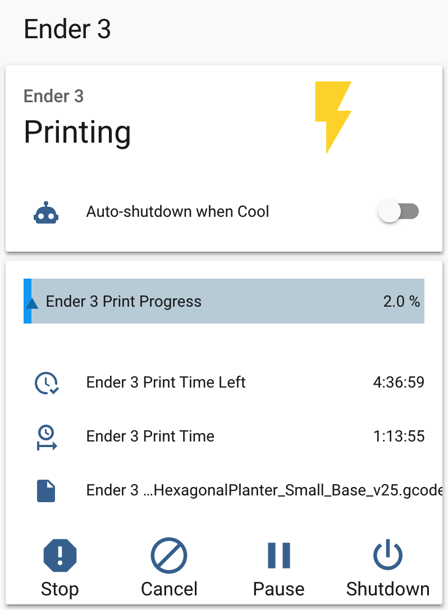
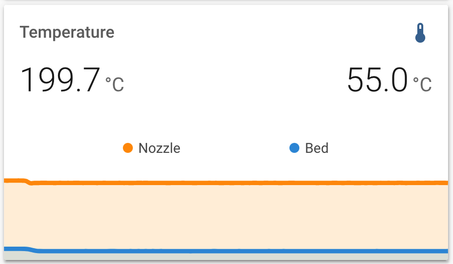

# OctoPrint-HomeAssistant

Enable MQTT based discovery of one or more OctoPrint servers within Home Assistant.

## Setup

Install via the bundled [Plugin Manager](https://docs.octoprint.org/en/master/bundledplugins/pluginmanager.html)
or manually using this URL:

    https://github.com/cmroche/OctoPrint-HomeAssistant/archive/master.zip

You will also need the [OctoPrint-MQTT plugin](https://github.com/OctoPrint/OctoPrint-MQTT) installed and configured to connected to your Home Assistant MQTT service, and MQTT discovery enabled (should be the default). With these, by using the OctoPrint-HomeAssistant plugin your OctoPrint instance will automatically register a device and several sensors to follow your printer status, printing and slicing progress.

**_NOTE_** OctoPrint-MQTT works best with HomeAssistant if you leave the default "retain" option enabled. Remember to restart OctoPrint after configuring your MQTT broker settings or installing OctoPrint-HomeAssistant to properly register.

## Why use this plugin?

- MQTT updates are faster, and smaller than querying the Web API
- MQTT updates won't generate errors when OctoPrint isn't running
- MQTT is a local-push implementation, the HomeAssistant native OctoPrint integration uses local-polling
- No need to set static IP addresses or add manual configurations, it just works.

### Benefit from more sensors

- Reliable printer status, and is printing sensors.
- Current Z height
- Formatted print time, and print time remaining

## Multiple Instances

It is possible to use this plugin with multiple instances, but the instance and HA configurations must be carefully setup to work correctly.

If configuration isn't working, check the caveats below. Shutdown both OctoPrint instance, delete devices registered in HA--they will not update otherwise, and restart your instances after changes to the configuration are made.

- Do not copy the configuration files from one instance to another, it'll cause conflicts with unique IDs for devices. Change the `unique_id` for the homeassistant plugin section to fix.
- MQTT plugins **must** have unique base topics for each instance.
- OctoPrint instances should have unique names, though not strictly a requirement device names in HA use the instance name.

## Examples




### Example card setup for Lovelace

To use this example, you will need the custom components (available from [HACS](https://hacs.xyz/docs/installation/manual)):

- [Stack in Card](https://github.com/custom-cards/stack-in-card)
- [Bar Card](https://github.com/custom-cards/bar-card)
- [Mini Graph Card](https://github.com/kalkih/mini-graph-card)

```yaml
cards:
  - cards:
      - cards:
          - entity: sensor.ender_3_print_status
            name: Ender 3
            type: entity
            icon: None
          - entity: switch.ender3
            hold_action:
              action: more-info
            show_icon: true
            show_name: false
            tap_action:
              action: toggle
            type: button
        type: horizontal-stack
      - entities:
          - entity: automation.printer_ender_3_shutdown_when_cool
            name: Auto-shutdown when Cool
        show_header_toggle: false
        type: entities
    mode: vertical
    type: "custom:stack-in-card"
  - card:
      cards:
        - entity: sensor.ender_3_print_progress
          type: "custom:bar-card"
          positions:
            icon: "off"
            indicator: inside
        - entities:
            - entity: sensor.ender_3_print_time_left
            - entity: sensor.ender_3_print_time
            - entity: sensor.ender_3_print_file
          show_header_toggle: false
          type: entities
        - cards:
            - entity: switch.ender_3_emergency_stop
              hold_action:
                action: more-info
              name: Stop
              show_icon: true
              show_name: true
              type: button
            - entity: switch.ender_3_cancel_print
              hold_action:
                action: more-info
              name: Cancel
              show_icon: true
              show_name: true
              type: button
            - entity: switch.ender_3_pause_print
              hold_action:
                action: more-info
              name: Pause
              show_icon: true
              show_name: true
              type: button
            - entity: switch.ender_3_shutdown_system
              hold_action:
                action: more-info
              name: Shutdown
              show_icon: true
              show_name: true
              type: button
          type: horizontal-stack
      mode: vertical
      type: "custom:stack-in-card"
    conditions:
      - entity: binary_sensor.ender_3_printing
        state_not: "off"
      - entity: binary_sensor.ender_3_printing
        state_not: unavailable
    type: conditional
  - card:
      decimals: 1
      entities:
        - entity: sensor.ender_3_tool_0_temperature
          name: Nozzle
          show_state: true
        - entity: sensor.ender_3_bed_temperature
          name: Bed
          show_state: true
      hours_to_show: 1
      name: Temperature
      points_per_hour: 120
      type: "custom:mini-graph-card"
    conditions:
      - entity: binary_sensor.ender_3_printing
        state_not: "off"
      - entity: binary_sensor.ender_3_printing
        state_not: unavailable
    type: conditional
title: Ender 3
type: vertical-stack
```

### Adding an OctoPrint camera

It's not possible to expose the camera automatically through MQTT, but the OctoPrint camera can still be registered as a standard MJPEG camera in `configuration.yaml`

This will create a camera entity as `camera.octoprint_ender_3`

```yaml
camera:
  - platform: mjpeg
    name: OctoPrint Ender 3
    still_image_url: http://octopi.local/webcam/?action=snapshot
    mjpeg_url: http://octopi.local/webcam/?action=stream
```

### Sending commands to the printer

There are services enabling homing, jogging, and sending extra GCODE commands directly to the printer enabling advanced scripts, add new buttons for extended functionality.

Remember to change `octoPrint/` in the examples below to the correct base topic configured in the **OctoPrint-MQTT** plugin.

#### Homing a printer from Lovelace

```yaml
type: entity-button
name: Home all axes
tap_action:
  action: call-service
  service: mqtt.publish
  service_data:
    topic: octoPrint/hassControl/home
    payload: '["x", "y", "z"]'
```

#### Jogging the tool from Lovelace

```yaml
type: entity-button
name: Jog X 0.1
tap_action:
  action: call-service
  service: mqtt.publish
  service_data:
    topic: octoPrint/hassControl/jog
    payload: '{"x": 0.1, "speed": 1.0 }'
```

#### Send GCODE from Lovelace

```yaml
type: entity-button
name: Level Bed
tap_action:
  action: call-service
  service: mqtt.publish
  service_data:
    topic: octoPrint/hassControl/commands
    payload: "G29"
```

#### Auto-shutdown once the printer has cooled down

```yaml
- id: "1592949271183"
  alias: PRINTER - Ender 3 - Shutdown when cool
  description: Shutdown the printer once is has cooled down
  trigger:
    - below: "40.0"
      entity_id: sensor.ender_3_tool_0_temperature
      for: 00:01:00
      platform: numeric_state
  condition:
    - condition: not
      conditions:
        - condition: state
          entity_id: binary_sensor.ender_3_printing
          state: "On"
  action:
    - data: {}
      # This is the safe shutdown script, see example below
      service: script.1592948735781
    - data: {}
      entity_id: automation.printer_ender_3_shutdown_when_cool
      service: automation.turn_off
```

#### Safe shutdown of Raspberry Pi, then printer

Sometimes the SD card can be thrashed when not shutting down the RPI gracefully, this automation calls system shutdown in OctoPrint, waits 2 minutes, then turns off the printer's switch.

##### Caveat

One user (thanks @pinkywafer) tested shutdown time and found it took from 5 seconds to 2+ minutes. Adjust the timeout to your needs, keep a backup if you use shorter values.

```yaml
"1592948735781":
  alias: Ender 3 Safe Shutdown
  sequence:
    - device_id: 5573a438b2af4ca5b93ac58e09f21f71
      domain: switch
      entity_id: switch.ender_3_shutdown_system
      type: turn_on
    - wait_template: "{{ is_state('sensor.ender_3_print_status', 'unavailable') }}"
    - delay: 00:02:00
    - device_id: 179ae3ecd31f4798abe05436a3f04d43
      domain: switch
      entity_id: switch.ender3
      type: turn_off
```

### Sending commands to the printer using a Blueprint

One user (thanks @SirGoodenough) has created a blueprint that will generate most of the same printer commands using this Plug-In.
If you would like to check that out, the link for that BluePrint is here:

[🧯 Octoprint Additional Buttons Helper](https://github.com/SirGoodenough/HA_Blueprints/blob/master/Automations/Octoprint_Additional_Buttons_Helper.md)

## Breaking Changes

### Print Time Formatting < v3.5.6

The time data that used to be sent to Home Assistant (octoprint-homeassistant > v3.6.3) had to be changed to allow for Print Time graphs. With this change, it means that the received value for Print Time, Print Time Left and Approximate Total Print Time is now in seconds. This will require formatting before being used in it's raw state. In a notification for example:

```yaml
service: notify.mobile_app_somedevice
data:
  title: Printing {{ states(`sensor.octoprint_print_file`) }}
  message: >-
    Your print has {{ timedelta(seconds=states(`sensor.octoprint_print_time_left`)|int(default=0)) }} left,
    after {{ timedelta(seconds=states(`sensor.octoprint_print_time`)|int(default=0)) }}.
    Current Z{{ states(`sensor.octoprint_current_z`) }}
  data:
    notification_icon: mdi:printer-3d
```

This new method allows you to format the time however you would like within Home Assistant.

_It is possible to still use the old formatting for the time sensors by reading the attributes of some of the sensors._

- Approximate Total Print Time:
  `state_attr('sensor.octoprint_approximate_total_print_time', 'EstimatedPrintTimeFormatted')`

- Print Time:
  `state_attr('sensor.octoprint_print_progress', 'PrintTimeFormatted')`

- Print Time Left:
  `state_attr('sensor.octoprint_print_progress', 'PrintTimeLeftFormatted')`
